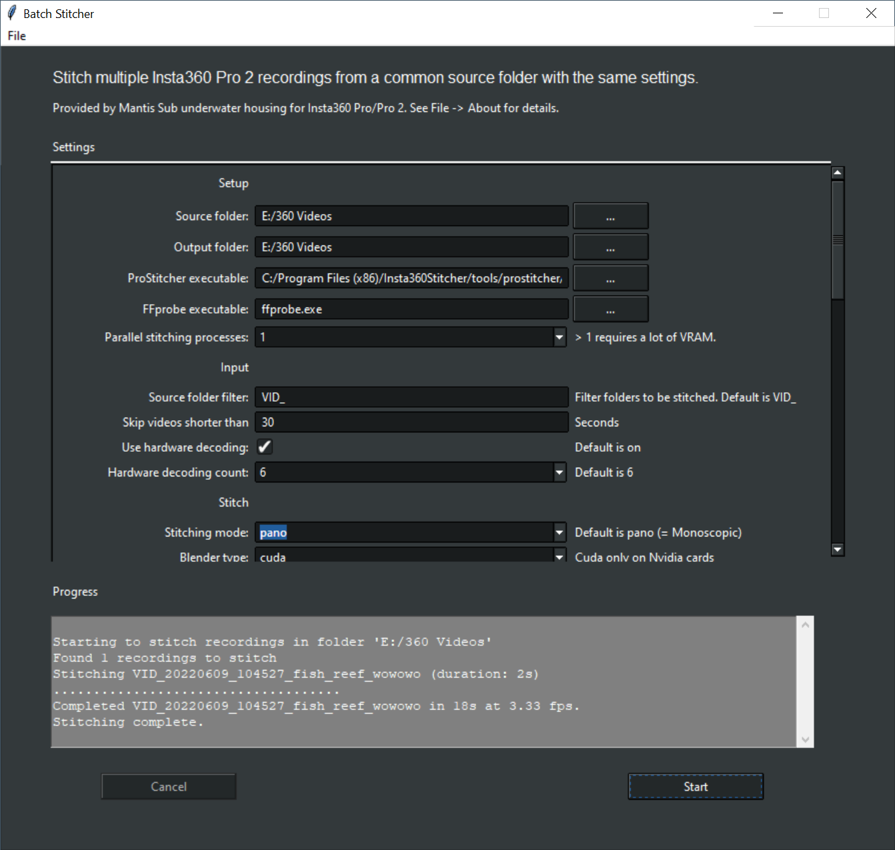

# Batch Stitcher for Insta360 Pro 2

## Introduction

Batch Stitcher can stitch multiple Insta360 Pro 2 recordings from a common source folder with the same settings. It is written in Python but calls ffprobe and Insta360 Stitcher binaries to perform video file analysis and stitching.

## Installation

### From binaries

The releases section contains binary distributions for Windows and macOS that were packaged with pyinstaller. Install these as follows

#### Windows 

- Double-click on the installer .exe
- You may be presented with a Security Warning. 
  - Click on “More Info” -> click “Run anyway”.

#### macOS

- Both Intel and Apple CPUs are supported (Apple Silicon via Rosetta 2) for macOS Big Sur (11.0) and higher.
- Open the .dmg file and drag batchstitcher.app and ffprobe to your /Applications folder.
- When starting the app you may be presented with a Security Warning. 
  - Click OK, then go to System Preferences -> Security & Privacy -> click “Open Anyway”.
  - You have to do this for batchsticher as well as ffprobe.
- If you double-click on the app and nothing happens you likely have macOS 10.15 or lower, which is not supported.


### From source

Install your favourite version of Python 3 (Python 3.8 or higher). See https://www.python.org/downloads/

If you're on macOS and install Python via homebrew, you might have to install python-tk separately.

```
brew install python@3.11
brew install python-tk@3.11
```

Download or clone the repository, then start batchsticher.py from the command line.
```
python3 batchsticher.py
```


## Usage



The stitching process relies on two external programs, which you will have to configure before you can start.
- **ProStitcher**, which is part of the Insta360Stitcher application.
  - Download: https://www.insta360.com/download/insta360-pro2
  - Insta360 can provide optimized versions for RTX30xx, RTX40xx and Apple Silicon on request.
  - For convenience Mantis Sub support page contains download links for Stitcher version 3.1.3, which supports RTX20xx, 30xx, and 40xx: https://www.mantis-sub.com/support/#insta360stitcher 
- **ffprobe**, which is part of the free FFmpeg video utilities. 
  - This is included in the binary distribution, but must be downloaded if you use the source distribution.
  - Download: https://ffmpeg.org/download.html


At a minimum you must enter the following settings:

- Source folder: The folder which contains the VID_xxx_xxx project files
- Target folder: The folder where the program should save the stitched video files
- ProStitcher executable: Choose your Insta360Stitcher installation.
  - Default for Windows: C:/Program Files (x86)/Insta360Stitcher/tools/prostitcher/ProStitcher.exe
  - Default for macOS: /Applications/Insta360Stitcher.app/Contents/Resources/tools/ProStitcher/ProStitcher
  - You may select the Insta360Stitcher folder or the ProStitcher binary
  - Insta360 can provide optimized versions for RTX30xx and Apple Silicon
 
The other parameters should be familiar from the Insta360 Stitcher UI. 

Some options are named slightly differntly (e.g. pano instead of Monoscopic). 
This is because the ProStitcher executable uses different configuration strings than the Insta360Stitcher UI. 

The following three settings are of special importance: 

- Blender type:
  - Blender type selects the stitching backend (library).
  - Four options are available but it depends on your hardware which is supported.
    - "auto" lets ProStitcher choose wich backend to use. Not recommended.
    - "cuda" is the fastest backend, but only available with NVidia GTX/RTX GPUs and a compatible Insta360Stitcher version
    - "opencl" is the 2nd fastest and available with all most GPUs on all platforms.
    - "cpu" is the slowest and available on all platforms.
  - If you choose a blender type that's not supported by your hardware, ProStitcher might not show an error and fall back to 'cpu' mode, which is very slow. 
  - It is recommended to try "opencl" and compare with your default settings to see which one is faster.

- Use hardware encoding: 
  - If you activate "Use hardware encoding" in the output section, and the encoding settings are not supported by your hardware, you'll see an error message in the progress window that says so (return code 244 - hardware encoding not supported). 
  - In this case please deactivate "Use hardware encoding" and try again.

- Bitrate:
  - Unlike Insta360Stitcher, batchstitcher does not automatically update the default bitrate when you change codec or resolution.
  - Please confirm your bitrate is suitable for your codec and resolution.
  - If you enter a bitrate that's too high or too low, you may get an error 244 (Codec/Profile not supported).
    - Adjust your bitrate, codec, or encoding profile.

## Problem resolution

- Please do not rename the original recording files (origin_1.mp4, origin_1_lrv.mp4, etc.), or stitching will fail.
- The progress window should provide enough information if something goes wrong. 
- Some combinations of Codec / Profile / Bitrate don't work. 
  - In this case you will get an error 244 (Codec/Profile not supported)
  - Try with a different codec, encoding profile, or bitrate.
- The progress window also shows the paths to the stitcher logfile for each stitch that fails.
- The progress window shows the achieved stitching frame rate (fps) at the end of the stitching process. 
  - If the frame rate is below 1 fps it is likely that ProStitcher is using "cpu" blender type. 
  - Please check if blender type "opencl" provides a faster stitch.
- "Could not save settings" error message on windows.
  - Resolution: Copy the file "batchstitcher.ini" into the folder %APPDATA%/BatchStitcher
  - https://github.com/MantisSub/batchstitcher/releases/download/v0.0.3/batchstitcher.ini
- If you double-click on the app and nothing happens you likely have macOS 10.15 or lower, which is not supported.
